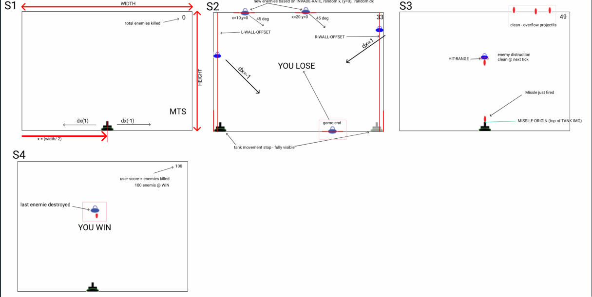

## Classic Game: Space Invaders

Recreating minimum features set of space invaders in Scheme (dialect of Lisp).

### Domain Analysis

### Demo

## Features
- User can interact with tank, move it left/right and shoot
- User can kill enemy ships by shooting projectiles
- User can see score how many enemy ships killed
- Use will win if kill 100 ships
- User will lose if any of ships touch the 'ground'

- [Trello](https://trello.com/b/Ec9TDjbe/space-invaders)
- [Game Play](https://www.youtube.com/watch?v=rlZFHKzS030)

